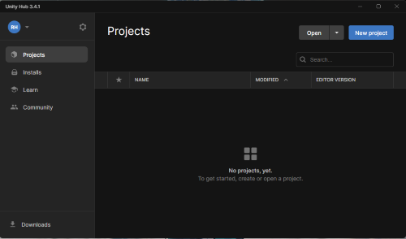
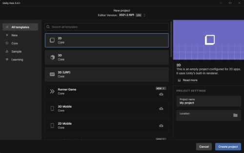

# Unity-2D-Workshop

This workshop aims to teach you the basics of Unity   To do so you'll create a 2D top-down shooting Game like Hotline Miami
 

## Requirements

* **Unity - Version 2021.3.16 (LTS)**
* **Visual Studio (not studio code)**

 

## What is Hotline Miami ?

Hotline Miami is a top-down shooter video game. The game is set in Miami in 1989. The player controls a nameless hitman who must complete a series of contracts. The game is known for its high difficulty and its retro-style graphics.  

In this workshop, we'll try to recreate the game's mechanics.

## Getting Started

To start this workshop, you'll need to create a new Unity2D Project. 

First Launch Unity Hub

Then click on the "New Project" button  
Then select the "2D" template

   
*Author : Hakim REDJEM*
