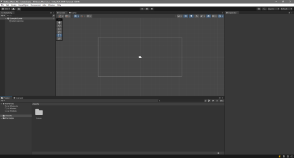

# Unity-2D-Workshop

This workshop aims to teach you the basics of Unity   To do so you'll create a 2D top-down shooting Game like Hotline Miami
 

## Requirements

* **Unity - Version 2021.3.16 (LTS)**
* **Visual Studio (not studio code)**
 

## What is Hotline Miami ?

Hotline Miami is a top-down shooter video game. The game is set in Miami in 1989. The player controls a nameless hitman who must complete a series of contracts. The game is known for its high difficulty and its retro-style graphics.  

In this workshop, we'll try to recreate the game's mechanics.

## Getting Started

To start this workshop, you'll need to create a new Unity2D Project. 

First Launch Unity Hub

Then click on the "New Project" button and select the "2D" template

### We're now set to begin !

You're now in front of the Unity Editor, let's start !  

## Steps

### Step 1 - Create the player
#### the goal of this step is to create a controllable player and bind the camera to it.

* Create a new 2D Sprite GameObject and name it "Player"
* Add a script to control the player's movement and orientation
* Add a script to the camera to follow the player

Some help for this step
 

 * For the player's movement, you'll use [Input](https://docs.unity3d.com/ScriptReference/Input.html)
 * For the camera the easiest way to make it follow the player is the [Transform.LookAt](https://docs.unity3d.com/ScriptReference/Transform.LookAt.html) method.

### Step 2 - Create the projectiles
#### the goal of this step is to make your player shoot !

* create a bullet generator
* make the player shoot

 some help for this step 
 

 * For the bullet generator you can use the [Instantiate](https://docs.unity3d.com/ScriptReference/Object.Instantiate.html) method
 * For the shooting you can use the [Input](https://docs.unity3d.com/ScriptReference/Input.html) class just for the previous step :)

### Step 3 - Create the enemies
#### the goal of this step is to create the enemies and to make them move towards the player.

* create an enemy prefab with a script to make it move towards the player
* create a spawner to spawn enemies

 Some help for this step 
 

 * For the enemy movement you can use the [Vector2.MoveTowards](https://docs.unity3d.com/ScriptReference/Vector2.MoveTowards.html) method
 * For the spawner you can use the [Instantiate](https://docs.unity3d.com/ScriptReference/Object.Instantiate.html) method

### Step 4 - Create the UI
#### the goal of this step is to create the UI and to make it work.
* add lifes to the player
* add Bullet count to the player (and reloading :))
* add a game over screen and a win screen (with a restart button)
* (optional) add a pause menu and a score counter

Some help for this step
 

 * For the UI you can use the [Canvas](https://docs.unity3d.com/Manual/class-Canvas.html) and the [UI](https://docs.unity3d.com/Manual/UIElements.html) components
 * For the game over screen you can use the [SceneManager](https://docs.unity3d.com/ScriptReference/SceneManagement.SceneManager.html) class

## Bonus !
#### if you have time you can :
* Just like the original game makes your player wield two weapons and aim lock one of them with your second mouse button
* Animate your player and enemies -> [learn sprite animation](https://learn.unity.com/tutorial/introduction-to-sprite-animations?language=en)
* Build a level -> look at [tilemaps](https://docs.unity3d.com/Manual/class-Tilemap.html)
* Add some background music and sounds -> [audio clip](https://docs.unity3d.com/2019.3/Documentation/Manual/class-AudioClip.html)
* Add some effects like falling cartridges or blood -> [Particle System](https://docs.unity3d.com/Manual/PartSysMain.html)

  
*Author : Hakim REDJEM*
